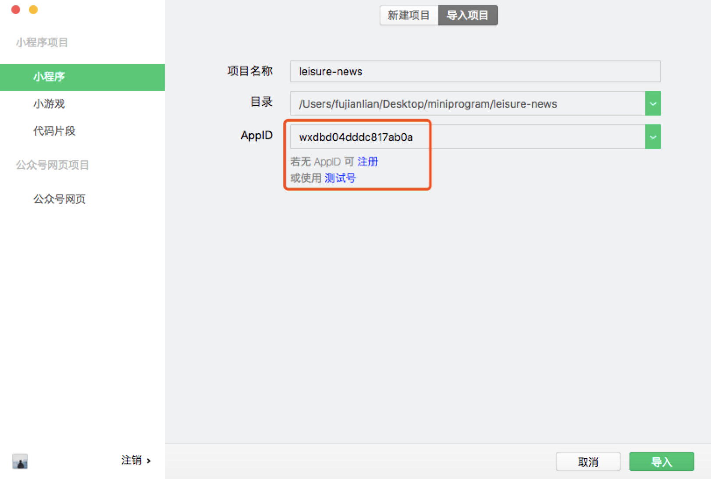
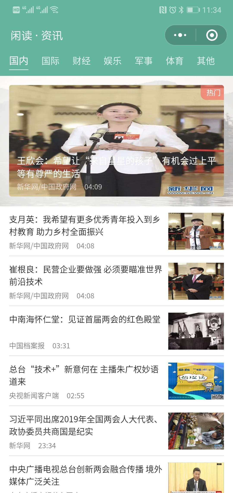
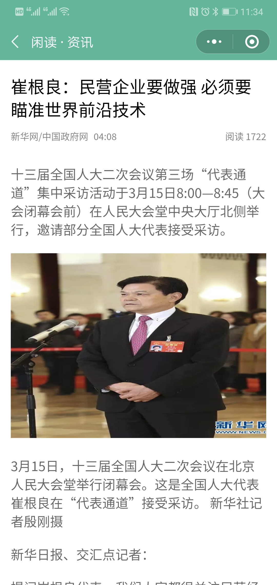

# 闲读 ∙ 资讯

优达学城新闻列表实战项目，界面效果实现类似市场上大多数新闻类app页面，适合小程序初学者，需要具备基础的**JavaScript**和**CSS**知识

## install

1. 安装[微信开发者工具](https://developers.weixin.qq.com/miniprogram/dev/devtools/download.html)

2. 下载源码，打开微信开发者，选择小程序导入源码，AppID可以自己[注册](https://mp.weixin.qq.com/cgi-bin/registermidpage?action=index)换成自己的或者直接点击使用测试号

 

3. 运行项目，如果遇到数据请求失败，点击右上角 **详情** ——> **项目设置**，将最底下 **不校验合法域名、web-view（业务域名）、TLS 版本以及 HTTPS 证书** 勾选上，自己注册的AppID可以在[微信公众平台](https://mp.weixin.qq.com/)添加合法域名，就无需勾选

## 页面展示

 |  |
| :--: | :--: |
| 首页 | 详情页 |
